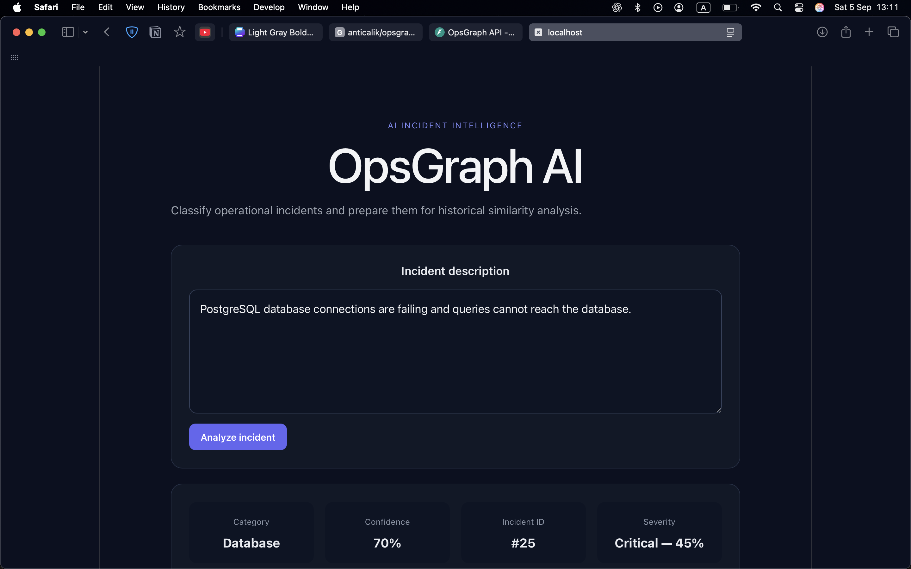
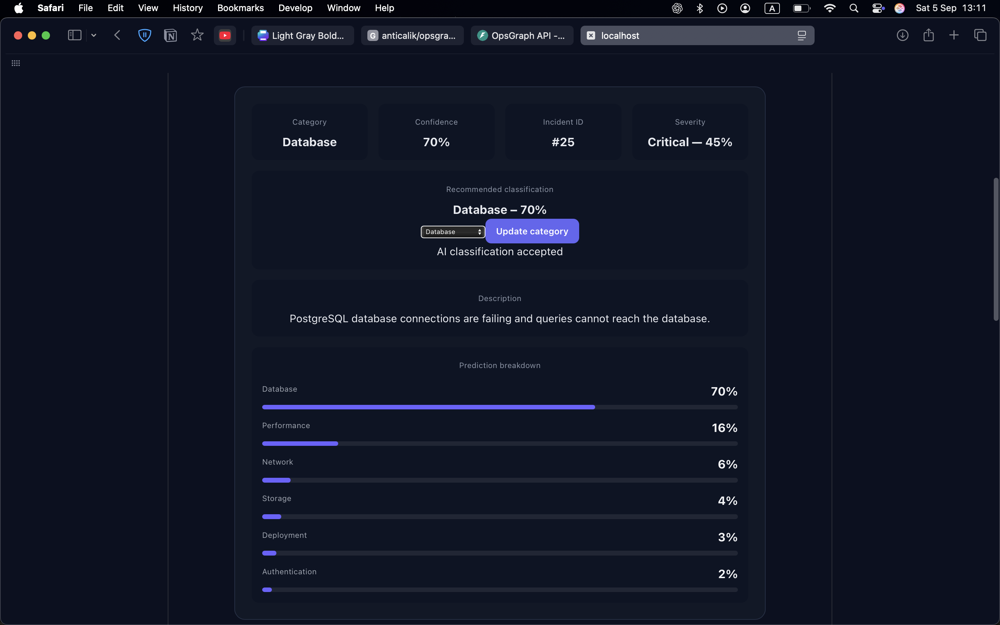
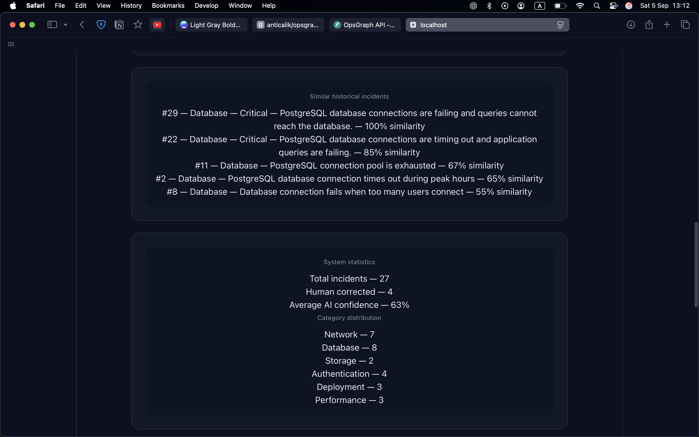
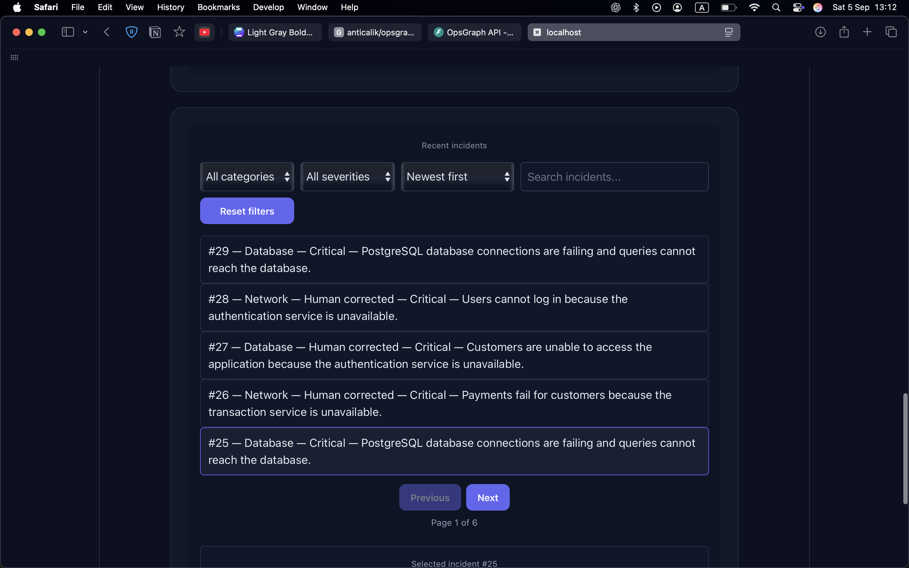
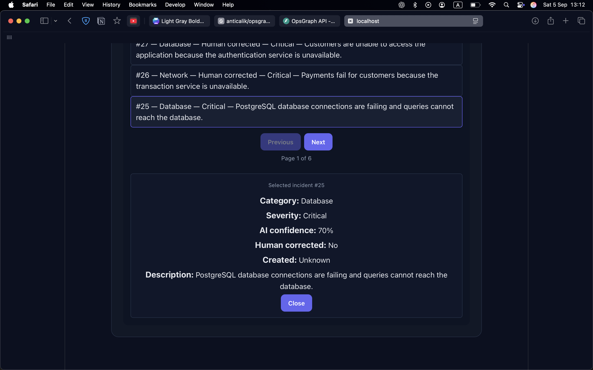

# OpsGraph AI

OpsGraph AI is an incident intelligence application for classifying operational incidents, estimating severity, and finding similar historical incidents.

The system combines automated incident classification with human correction, allowing classifications to be reviewed and corrected while preserving incident history.

## Features

- Automatic incident classification
- Category confidence scoring
- Severity prediction
- Prediction breakdown across incident categories
- Historical incident similarity analysis
- Human correction of AI-generated categories
- Incident history
- Category and severity filtering
- Incident search
- Sorting by date and severity
- Paginated incident history
- System statistics and category distribution

## Incident Categories

OpsGraph AI currently classifies incidents into:

- Database
- Network
- Deployment
- Authentication
- Storage
- Performance

## Tech Stack

### Backend

- Python
- FastAPI
- SQLAlchemy
- SQLite

### Frontend

- React
- Vite
- JavaScript
- CSS

## Project Structure

```text
opsgraph-ai/
├── backend/
│   └── app/
│       ├── main.py
│       ├── database.py
│       └── models.py
│
├── frontend/
│   ├── src/
│   │   ├── App.jsx
│   │   ├── App.css
│   │   └── main.jsx
│   └── package.json
│
├── .gitignore
└── README.md
```

## Running the Project

### Backend

From the project root:

```bash
cd backend
python3 -m venv .venv
source .venv/bin/activate
python -m pip install -r requirements.txt
uvicorn app.main:app --reload --port 8001
```

The backend API will run at:

```text
http://127.0.0.1:8001
```

### Frontend

Open another terminal and run:

```bash
cd frontend
npm install
npm run dev
```

The frontend will run at:

```text
http://localhost:5173
```

Keep both the backend and frontend terminals running while using the application.

## Screenshots

### Incident Analysis

Enter an operational incident and let OpsGraph AI classify its category and severity.



### Classification Results

View the predicted category, confidence score, severity, and prediction breakdown. The AI-generated category can also be corrected manually.



### Historical Similarity Analysis

Compare the analyzed incident with similar historical incidents and view system statistics.



### Incident History

Browse, search, filter, sort, and paginate through previously analyzed incidents.



### Incident Details

Select an incident from the history to inspect its classification, severity, confidence, correction status, and description.


